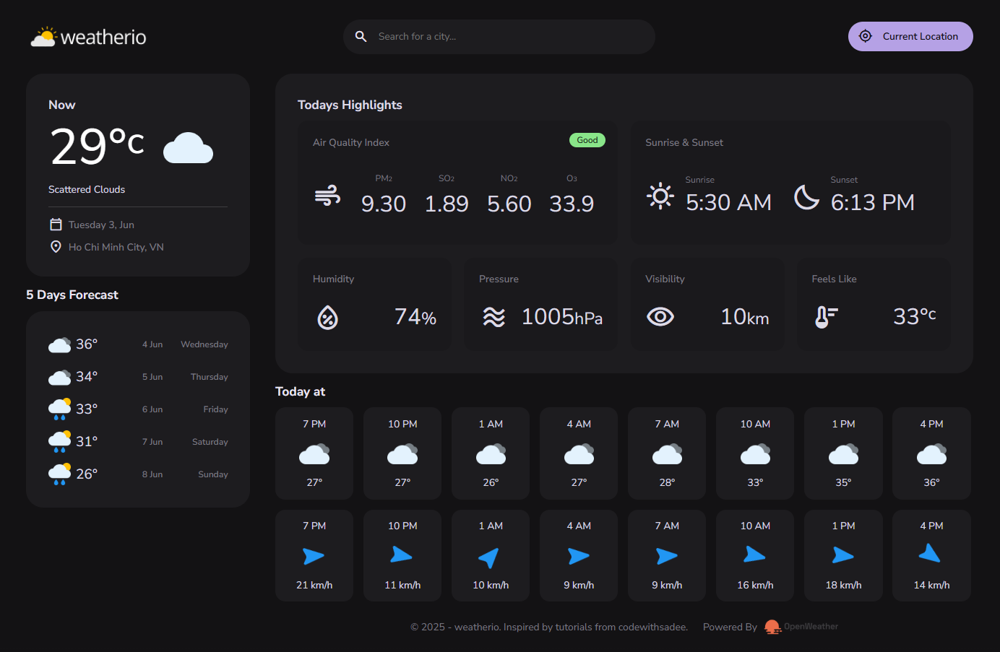

# WeatherIO API 🌤️

<div align="center">

<p><em>Weatherio Interface</em></p>
</div>

## 🌟 Main Features

- **Current Weather**: View detailed weather info for your current location
- **5-Day Forecast**: Detailed forecast for the next 5 days
- **Location Search**: Search weather by city name
- **Auto Location Detection**: Automatically fetch weather info using GPS
- **Detailed Info**:
  - Air quality index
  - Sunrise and sunset time
  - Humidity, pressure, visibility
  - Feels-like temperature
  - Hourly forecast with wind speed and direction

## 🚀 Live Demo

>### [https://quangthoit.github.io/weatherio/](https://quangthoit.github.io/weatherio/)

## 🛠️ Technologies Used

- **Frontend**: HTML5, CSS3, JavaScript
- **API**: OpenWeatherMap API
- **Hosting**: GitHub Pages
- **Design**: Responsive Web Design, Mobile-first approach

## 📱 User Interface

- Dark theme with a modern and elegant look
- Responsive design - compatible with all devices
- Card-based layout for organized data presentation
- Realtime data display with detailed metrics
- Weather icons and intuitive visuals
- Color-coded air quality indicators

## 📚 How to Use

### Search for Weather

1. Enter the city name into the search box
2. Select a city from the suggestion list
3. View detailed weather info

### Use Current Location

1. Click the "Current Location" button
2. Allow location access when prompted by your browser
3. View weather info for your current location

### View Forecast

- See 5-day forecasts with temperature and weather details
- Check hourly forecast for the current day
- View wind speed by the hour

## 🌐 OpenWeatherMap API

>### [https://openweathermap.org/](https://openweathermap.org/)

## 📁 Project Structure

```
weatherio/
│
├── assets/                   # Assets folder
│   ├── css/                  # Stylesheets
│   ├── font/                 # Web fonts
│   ├── images/               # Images, icons
│   └── js/                   # JavaScript modules
│       ├── api.js            # API handling
│       ├── app.js            # Main application logic
│       ├── module.js         # Utility modules
│       └── route.js          # Routing logic
├── favicon_weatherio.svg     # Website favicon
├── index.html                # Main page
└── README.md                 # Documentation
```

## 🎨 Highlights

### Responsive Design

- Desktop: 2-column layout with sidebar
- Tablet: Adaptive layout
- Mobile: Optimized single-column layout

### Performance

- Lazy loading for images
- Debounced search to reduce API calls
- Weather data caching
- Optimized JavaScript and CSS

### UX/UI

- Loading states for all API calls
- Friendly error handling
- Smooth transitions and animations
- Accessible design (keyboard navigation, screen reader support)

## 👨‍💻 Author

>### QuangThoIT: [https://github.com/quangthoIT/](https://github.com/quangthoIT/)

## 🙏 Acknowledgments

>This project was built based on the tutorial by **codewithsadee** on [YouTube](https://www.youtube.com/@codewithsadee). Big thanks for the valuable content!

---

⭐ If you find this project useful, please consider giving it a star on GitHub!
